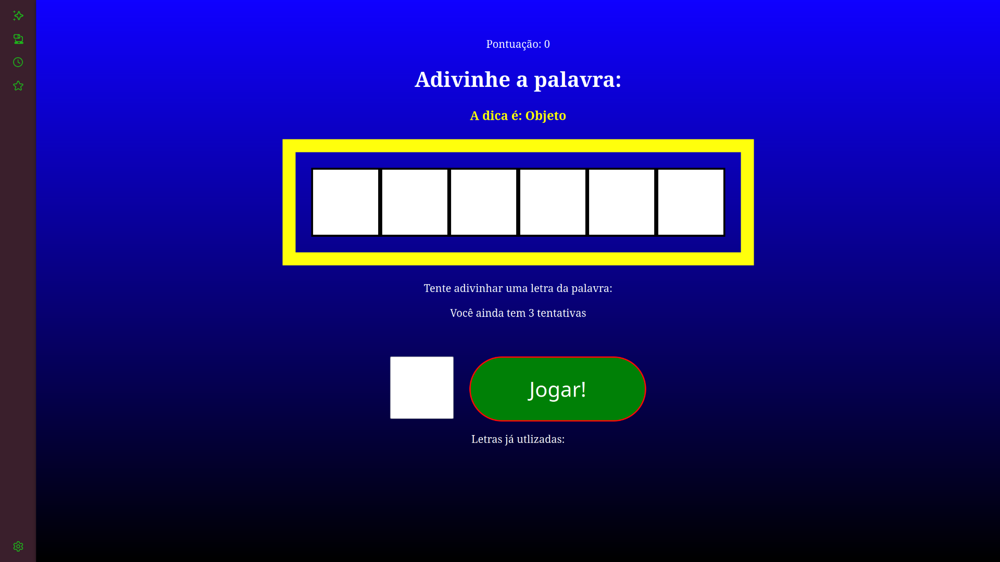

# Secret Word 🎮

Um mini-jogo de adivinhação de palavras, inspirado no clássico programa do Silvio Santos! Desenvolvido com Vite + React para uma experiência rápida e divertida.

## Link para jogar

https://o-cuellar.github.io/secretword/

## Como jogar

- Tente adivinhar a palavra secreta, letra por letra.  
- Você tem 3 tentativas para acertar.  
- Acompanhe seus acertos e erros na tela.  
- Sua pontuação aumenta conforme acerta letras.

## Como rodar localmente

1. Clone o repositório  
2. Instale as dependências com npm install  
3. Rode o projeto com npm run dev  
4. Acesse http://localhost:3000 no seu navegador

## Tecnologias usadas

- React  
- Vite  
- JavaScript (ES6+)  
- CSS Modules  

## Demo

## Licença

MIT License
